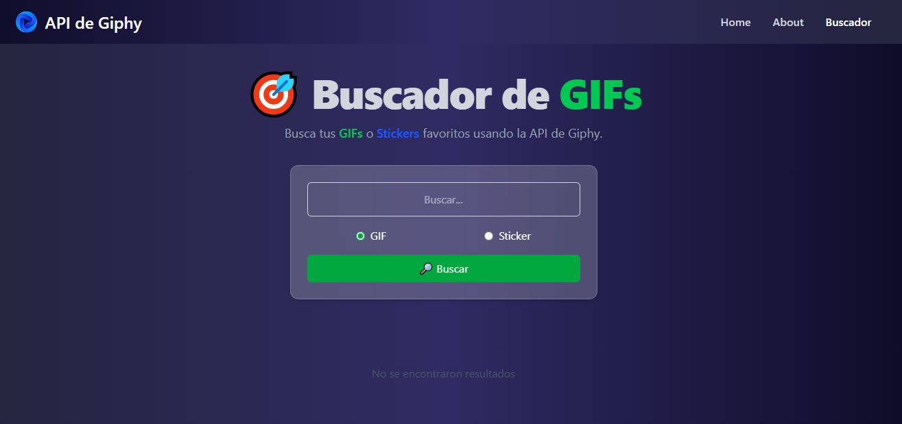
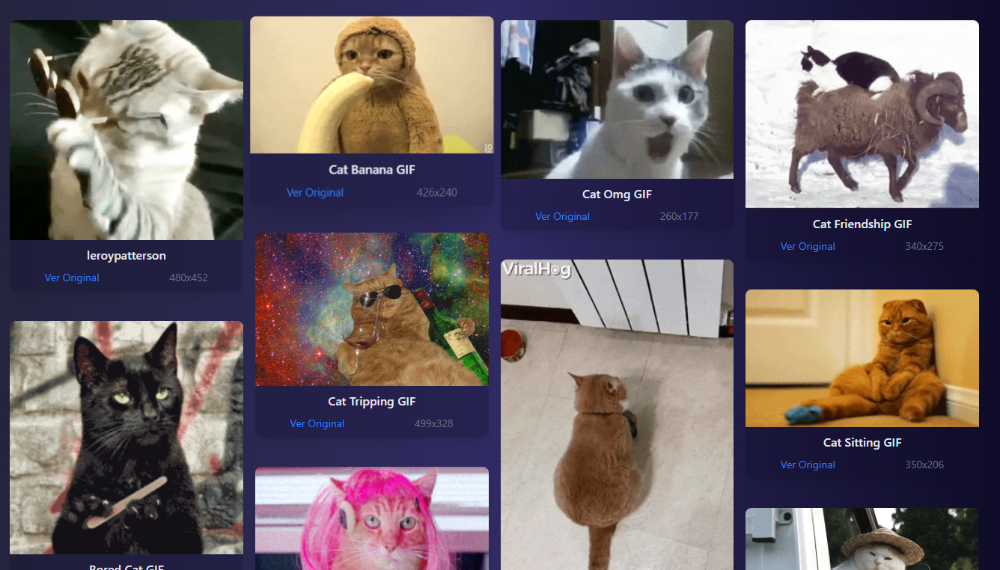

# 🎯 Buscador de Gifs

Un buscador de GIFs interactivo desarrollado con **Vue 3** y **Vite**, que permite buscar y visualizar gifs de manera dinámica utilizando la API de GIPHY.

🔗 **Demo en vivo:** [Ver proyecto en Vercel](https://buscador-giphy-flax.vercel.app/)
---

## 📸 Vista Previa

### 🏠 Página de Inicio


### 🔎 Buscador en acción


### 🐱 Resultados de búsqueda (Gatos)


---

## 🚀 Tecnologías Utilizadas

- ⚙️ Vue 3
- ⚡ Vite
- 🎨 TailwindCSS (si lo usaste)
- 🌐 Giphy API

---

## 🔍 Funcionalidades

- Búsqueda de gifs por palabra clave
- Resultados en tiempo real desde la API de Giphy
- Interfaz responsiva y simple

---

## 🛠️ Instalación y Uso

```bash
git clone https://github.com/rick672/Buscador-Giphy.git
cd 008_buscadorGifs
npm install
npm run dev
